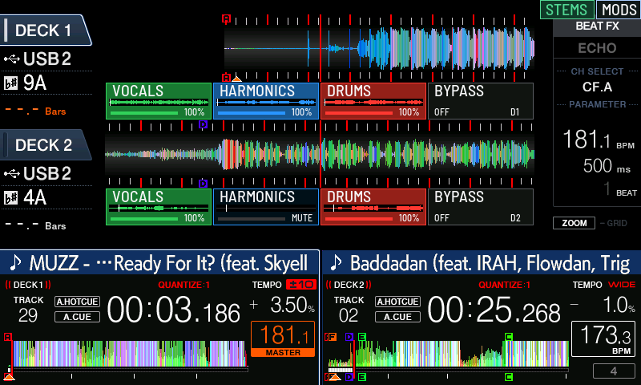
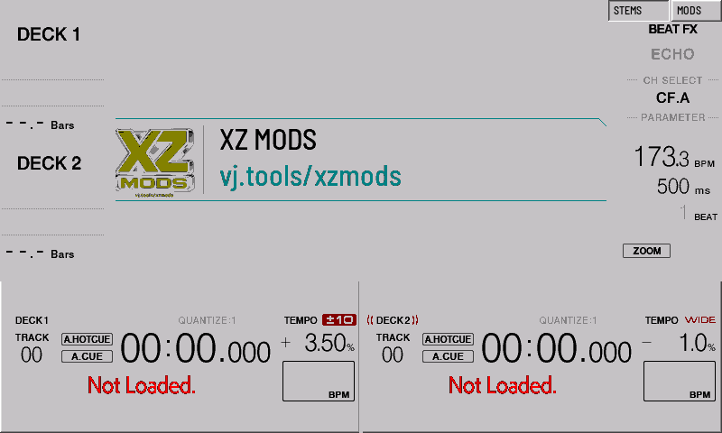

# XZ Mods user guide

For XDJ-XZ firmware 1.26 and Windows release 0.1.5. This download
includes the split rows, themes and physical pad fixes shown below. Rebuild
your existing USB loader to get the update. Back up and remove its existing
`autoexec.bin` before using the builder. See [build instructions](../BUILDING.md)
to build source.

## Prepare your USB

1. Back up your Rekordbox USB. Start with a few tracks and a spare FAT/FAT32 USB.
2. Download [release 0.1.5](https://github.com/OpticMystic/XZ-Mods/releases/tag/v0.1.5).
   Extract it and keep `XZ Mods.exe` beside its `resources` folder. Windows needs
   WebView2. VJ.Tools and a separate Python installation are not required.
3. Plug in the USB. In **Prepare USB**, click **Choose USB and prepare loader**
   and select the USB drive root. The app downloads and verifies the official
   firmware and required boot support, then builds and checks `autoexec.bin`.
   First setup downloads about 320 MB; verified files are cached locally.
   The USB must be FAT/FAT32. Existing music and loader files are not overwritten.
   The public download contains no firmware, boot support or personal boot image.
4. For OverCue-prepared tracks, keep matching `Contents` and `CDJMODS` folders on
   the same USB. Open **Prepare stems → Check OverCue track** and choose the
   original track inside `Contents`. This reads the source and all prepared pages
   without changing them. Supported prepared format is `overcue-stems/4`.
5. Alternatively, use the included separation or aligned-stem import workflow
   to create a legacy `stemd-cache/1` cache. It does not export OverCue bundles.

Start the XZ with the prepared mod USB using the boot procedure for your image.
Load the matching original through the native browser. Wait for stem loading to
finish, listen quietly to the original mix, then test each stem. A successful
file check does not establish audible alignment or playback performance.

## Use the split rows in current source

Each deck has four controls: **Vocals, Harmonics, Drums, Bypass**.

- Tap a stem to mute or restore it.
- Drag horizontally on a stem button to adjust its volume percentage. Raising
  a muted stem restores it.
- Tap Bypass to switch that deck to its original mix.
- Tap the top STEMS button to hide or show the rows. Visibility does not disable
  stem audio or the physical pad assignments.

This is a real capture of the runtime included in preview 0.1.4.
Earlier preview 0.1.2 has the selected-deck strip.

## Assign physical stem pads

Open **MODS → Controls**. Choose a stem pad page and the **A–D** or **E–H** bank,
then select that physical pad page on the deck. Keep pad feedback enabled.

| Position in assigned bank | Control | Current-source physical color |
| --- | --- | --- |
| First | Vocals | Green |
| Second | Harmonics | Blue |
| Third | Drums | Red |
| Fourth | Bypass | White when enabled |

Active stems use normal brightness; muted or zero-volume stems are dim.
The inactive bank retains native hot cues. Deck assignments are independent.
Physical colors do not change with the screen theme. Brightness and clean
audio were confirmed on hardware. The tester also confirmed the latest pure
green, blue and red hues.

## Change appearance in current source

Open **MODS → Appearance**, choose a style and close MODS to see the native
player. Styles are Original, White, Cyberpunk, Neon, Mocha, Aurora, Sandstone,
Game Boy, Super Nintendo, Windows 95, Game Boy Color and Aqua / iTunes.
Preview 0.1.2 includes the seven earlier styles.

This RAM-trial capture shows gray panels, dark text and the XZ Mods loading
banner with no tracks loaded. The native adapter covers artwork, text,
waveforms, markers and dialogs; full screen-family verification is ongoing.
The 0.1.4 loader automatically applies the original loading artwork to a validated
copy of the device GUI in RAM. The public package contains only the replacement
artwork, not the manufacturer GUI pack.

The streamlined menu has Controls, Appearance, VJ.Tools and Advanced. Groove
pads and X-PAD remain under Advanced with readiness indicators. VJ.Tools is
optional; its corner button appears only when the connection setting is enabled
and the network connection is live. Exit VJ returns to native playback.

## Return to stock and recover

Power off, remove the mod boot USB and start normally. Rebooting with that USB
present can load the mod again. RAM-trial settings reset on reboot; normal USB
builds can save settings to the USB.

If audio becomes corrupted during testing, stop playback and fully reboot.
Reload the same track and check the original mix before continuing. The runtime
runs in RAM, but experimental software can still crash or disrupt playback.
The user confirmed USB preparation and XDJ-XZ cold boot with 0.1.5. Extended
two-deck, loop, focus and experimental-control qualification remains in progress.

## Related projects

- [CDJ3K-Mods](https://cdj3k-mods.com/) and its
  [source repository](https://github.com/nsaintot/cdj3k-mods): CDJ-3000 mods.
- [OverCue](https://overcue.gg/): CDJ-3000 mods and desktop stem preparation.
  XZ Mods reads supported prepared audio; the OverCue CDJ installer is not an XZ installer.
- [XDJ-RX3 Toolkit](https://github.com/Tratosca/rx3-toolkit): the RX3 project,
  not a mod for the original XDJ-RX.
- [XDJ-AZ Mods](https://github.com/Kyle-Hosman/xdj-az-mods): AZ mod loader and tools.

These projects have separate compatibility and installation requirements.
