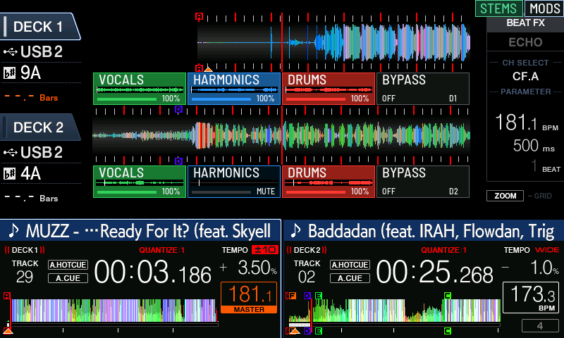
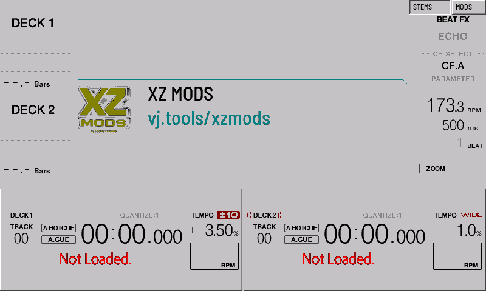

# XZ Mods user guide

For XDJ-XZ firmware 1.26 and Windows build 0.1.6. This download
includes the split rows, themes and physical pad fixes shown below. Rebuild
your existing USB loader to get the update. Back up and remove its existing
`autoexec.bin` before using the builder. See [build instructions](../BUILDING.md)
to build source.

## Prepare your USB

1. Back up your Rekordbox USB. Start with a few tracks and a spare FAT/FAT32 USB.
2. Extract the supplied XZ Mods 0.1.6 ZIP.
   Extract it and keep `XZ Mods.exe` beside its `resources` folder. Windows needs
   WebView2. VJ.Tools and a separate Python installation are not required.
3. Plug in the USB. In **Prepare USB**, click **Choose USB and prepare loader**
   and select the USB drive root. The app downloads and verifies the official
   firmware and required boot support, then builds and checks `autoexec.bin`.
   First setup downloads about 320 MB; verified files are cached locally.
   The USB must be FAT/FAT32. Existing music and loader files are not overwritten.
   The public download contains no firmware, boot support or personal boot image.
4. Prepare stems with [OverCue](https://overcue.gg/). This is the recommended
   path. OverCue Desktop separates your tracks and writes a `CDJMODS` folder on
   your Rekordbox USB. Keep the matching `Contents` and `CDJMODS` folders on the
   same USB. Open **Prepare stems > Check OverCue track** and choose the original
   track inside `Contents`. This reads the source and all prepared pages without
   changing them. The supported prepared format is `overcue-stems/4`.
5. Or use the beta stem builder in **Prepare stems > Build stems in XZ Mods**.
   It writes the same [open OverCue format](https://github.com/OverCue-gg/overcue-stems-format)
   under `CDJMODS` and never replaces stems OverCue made. Export the track with
   Rekordbox first. It must be a 44.1 kHz stereo WAV or FLAC file in the USB's
   `Contents` folder. Choose that track, choose an engine, then click
   **Prepare stems**. Separation runs on the CPU and is slow. To use stems you
   already have, open **Use stems you already have**, set up the engine and
   import aligned harmonics and vocals for the same track. The beta has not been
   qualified on hardware. Check each track on the player before you use it in a set.

Start the XZ with the prepared mod USB using the boot procedure for your image.
Load the matching original through the native browser. Wait for stem loading to
finish, listen quietly to the original mix, then test each stem. A successful
file check does not establish audible alignment or playback performance.

## Use the split rows in current source

Each deck has four controls: **Vocals, Harmonics, Drums, Bypass**.

- Tap a stem to mute or restore it.
- Drag horizontally on a stem button to adjust its volume percentage. Raising
  a muted stem restores it.
- Tap Bypass to switch that deck to its original mix.
- Tap the top STEMS button to hide or show the rows. Visibility does not disable
  stem audio or the physical pad assignments.

This is a real capture of the runtime included in preview 0.1.4.
Earlier preview 0.1.2 has the selected-deck strip.

## Assign physical stem pads

Open **MODS → Controls**. Choose a stem pad page and the **A–D** or **E–H** bank,
then select that physical pad page on the deck. Keep pad feedback enabled.

| Position in assigned bank | Control | Current-source physical color |
| --- | --- | --- |
| First | Vocals | Green |
| Second | Harmonics | Blue |
| Third | Drums | Red |
| Fourth | Bypass | White when enabled |

Active stems use normal brightness; muted or zero-volume stems are dim.
The inactive bank retains native hot cues. Deck assignments are independent.
Physical colors do not change with the screen theme. Brightness and clean
audio were confirmed on hardware. The tester also confirmed the latest pure
green, blue and red hues.

## Change appearance in current source

Open **MODS → Appearance**, choose a style and close MODS to see the native
player. Styles are Original, White, Cyberpunk, Neon, Mocha, Aurora, Sandstone,
Game Boy, Super Nintendo, Windows 95, Game Boy Color, Aqua / iTunes,
Game Boy DMG and Liquid Glass. Each of the last seven has **Light** and **Dark**
buttons, for 21 appearances total. The original green Game Boy remains available;
Game Boy DMG is the separate gray-shell design. The pixel font supports lowercase
and renders Latin-1 accents as base letters.
These additions are unreleased and have been reviewed in the software renderer.
They have not yet been loaded on the player.
Preview 0.1.2 includes the seven earlier styles.

This RAM-trial capture shows gray panels, dark text and the XZ Mods loading
banner with no tracks loaded. The native adapter covers artwork, text,
waveforms, markers and dialogs; full screen-family verification is ongoing.
The 0.1.4 loader automatically applies the original loading artwork to a validated
copy of the device GUI in RAM. The public package contains only the replacement
artwork, not the manufacturer GUI pack.

The streamlined menu has Controls, Appearance, VJ.Tools and Advanced. Groove
pads and X-PAD remain under Advanced with readiness indicators. VJ.Tools is
optional; its corner button appears only when the connection setting is enabled
and the network connection is live. Exit VJ returns to native playback.

## Return to stock and recover

Power off, remove the mod boot USB and start normally. Rebooting with that USB
present can load the mod again. RAM-trial settings reset on reboot; normal USB
builds can save settings to the USB.

If audio becomes corrupted during testing, stop playback and fully reboot.
Reload the same track and check the original mix before continuing. The runtime
runs in RAM, but experimental software can still crash or disrupt playback.
The user confirmed USB preparation and XDJ-XZ cold boot with 0.1.5. Extended
two-deck, loop, focus and experimental-control qualification remains in progress.

## Related projects

- [CDJ3K-Mods](https://cdj3k-mods.com/) and its
  [source repository](https://github.com/nsaintot/cdj3k-mods): CDJ-3000 mods.
- [OverCue](https://overcue.gg/): CDJ-3000 mods and desktop stem preparation.
  XZ Mods reads supported prepared audio; the OverCue CDJ installer is not an XZ installer.
- [XDJ-RX3 Toolkit](https://github.com/Tratosca/rx3-toolkit): the RX3 project,
  not a mod for the original XDJ-RX.
- [XDJ-AZ Mods](https://github.com/Kyle-Hosman/xdj-az-mods): AZ mod loader and tools.

These projects have separate compatibility and installation requirements.

## Update a USB that already has a loader

1. Open **USB loader > Choose USB to update** and select the USB root.
2. Check the selected folder and existing loader details.
3. Select **Back up and update loader**. The app verifies the new image before
   replacing `autoexec.bin` and keeps the previous bytes under
   `VJ.Tools/XZ-Mods-updates`.
4. Eject the USB safely after completion. Music, Rekordbox data and saved
   preferences remain in place.

If you selected a prepared folder, copy its resulting loader to the USB root.
Use **Restore a previous loader** to restore a checked backup. A changed file
or reconnected volume requires a fresh inspection. An update/restore does not
start the XZ or install firmware over a network.

## Edit saved settings

Open **USB settings**, choose the partition containing `VJ.Tools/XZ-Mods.cfg`,
change the fields, and click **Save settings to USB**. The app reads the file
back after saving. Select a pad row in Stem shortcuts to assign A-D or E-H.
Beat Jump shows backward/forward pairs and both beat/bar units. New options
require the matching updated loader. Unknown settings formats are preserved
and cannot be overwritten by this editor.

If the loader uses a separate settings partition, choose that partition rather
than the music partition. The current controller trial uses USB1's first
partition because the second reported a FAT error and is mounted read-only.

## Controller controls

**Close** is at the top right, where MODS opens. **Controls** has separate
**Stem Shortcuts** and **Beat Jump** views. Both show eight pads. Stem shortcuts
assign one four-pad row; Beat Jump assigns four backward/forward pairs on each
page. Page 2 defaults to 16/32/64/128 beats, or 4/8/16/32 bars. Shift + Beat Jump
selects page 2 by default, with alternate warm red/orange pad lights.

## Browse USB tracks and prepare stems

Open Prepare stems. XZ Mods selects a connected USB with a Rekordbox Device Library. Use the drive selector or Choose drive to change it. The table reads track titles and artists from the exported database, shows USB free space, and checks the corresponding stem files.

Choose Open-Unmix HQ or Vocal focus, then click Generate beside a track. Required model files download on first use. Tracks must be 44.1 kHz WAV or FLAC exports. OverCue remains the recommended preparation tool.

Prepared means all seven stem files are present. Click Verify to check the audio pages and source checksum. Check playback timing on the XZ before a set.

## Import instrument stems

Click Import stems beside a track. Drop its individual stem files into the import area, then assign each to Drums, Vocals or Harmonics. You can assign several files to each group. XZ Mods adds them together and writes the seven OverCue playback combinations. Your supplied drums remain the drum part; they are not reconstructed from the complete mix.

Use files that start at the same point as the complete track. By default, lengths must match. The length adjustment checkbox pads shorter files with silence and trims longer files. It does not correct offsets or time-stretch audio. Unassigned groups are silent.

## Update the Windows app

Open App updates and choose Check for updates. When a signed update is available, review its new features and bug fixes, then choose Download and install update. Finish any USB or stem operation first. The Windows installer updates the app and reopens it.

For a portable copy, download the ZIP and extract it into a new folder. The in-app installer installs the standard Windows version. Updating the app does not replace the loader on a USB; use USB loader for that.
